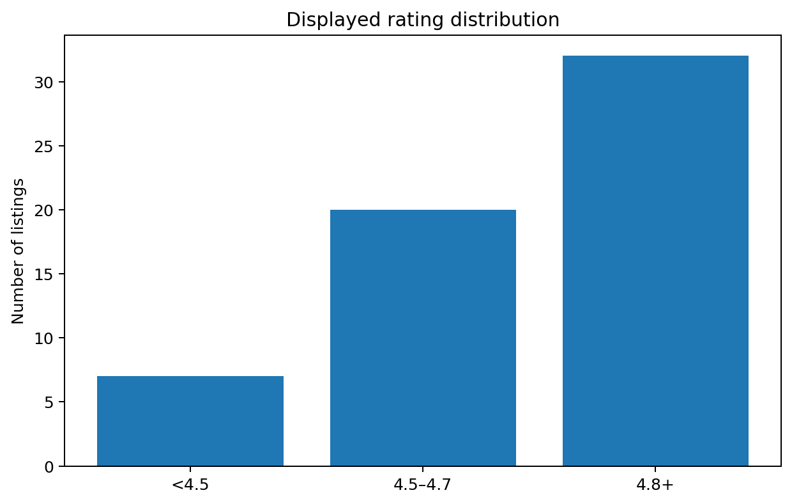
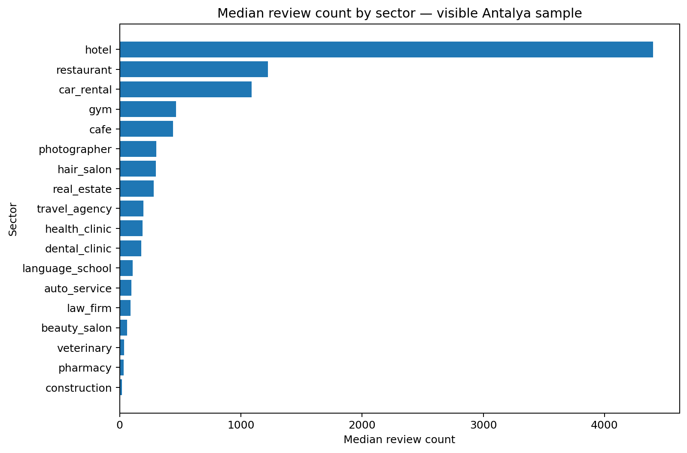
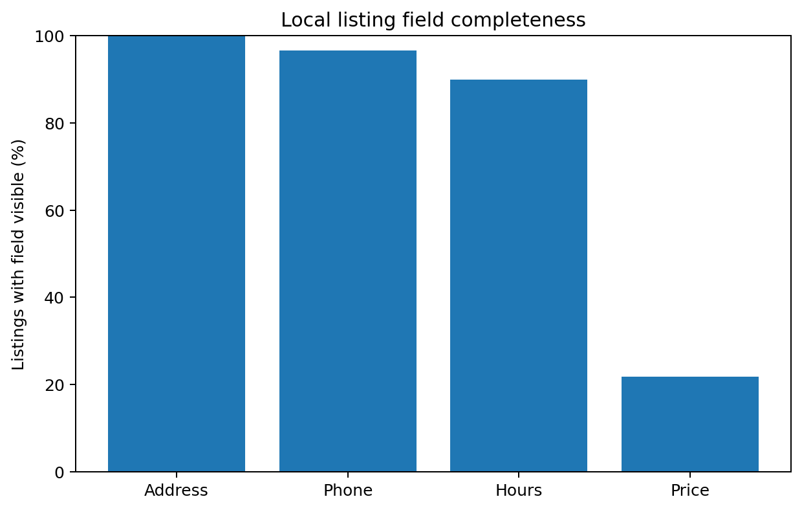

# Antalya Local Search Visibility Benchmark 2026

**Grainz Digital Open Research · v1.0.0 · 24 August 2026**

This benchmark examines **60 highly visible local-business listings across 18 sectors in Antalya**. It is designed as a practical visibility benchmark for local SEO and digital presence work.

> **Important:** this is a purposeful sample of visible results, not a random survey of all Antalya businesses. The findings describe the sampled visibility set and should not be interpreted as citywide prevalence or causal ranking factors.

## Executive summary

- The median displayed rating is **4.8/5**; **88.1%** of rated observations are at least 4.5.
- **54.2%** are rated 4.8 or higher, so a high star score alone is not rare among already-visible businesses.
- Median review count is **188**, but the distribution is highly sector-dependent.
- **67.8%** of observations with review data have at least 100 reviews; **18.6%** have at least 1,000.
- Basic local-listing fields are largely complete among visible results: address **100.0%**, phone **96.7%**, hours **90.0%**.
- Price information surfaced in only **21.7%** of observations, but this field is not equally relevant or supported in every sector.

## What the data suggests

### 1. Reputation differentiation is more than star rating
Among rated observations, **54.2%** already sit at 4.8+. In a visibility-heavy sample, “good rating” is table stakes. Review volume, recency, listing completeness, website quality, relevance and other signals should be treated as separate optimization dimensions rather than assuming a 4.9 score is sufficient.

### 2. Review benchmarks must be sector-specific
The median review count across the full sample is **188**, yet hotel and restaurant results operate at a completely different scale from construction, pharmacy or professional-service categories. A single “get X reviews” target for every Antalya business would be misleading.

### 3. Basic listing completeness is table stakes among visible results
Address and phone information are visible for almost the entire sample, and opening hours are visible for nine out of ten observations. For businesses competing for local discovery, simply completing the basics is necessary but unlikely to be a meaningful differentiator by itself.

## Sector benchmark table

| Sector | n | Avg. rating | Median reviews |
|---|---:|---:|---:|
| hotel | 4 | 4.38 | 4399 |
| restaurant | 5 | 4.48 | 1224 |
| car_rental | 3 | 4.80 | 1087 |
| gym | 3 | 4.53 | 465 |
| cafe | 3 | 4.73 | 440 |
| photographer | 3 | 4.90 | 301 |
| hair_salon | 4 | 4.75 | 298 |
| real_estate | 3 | 4.65 | 280 |
| travel_agency | 3 | 4.63 | 195 |
| health_clinic | 3 | 4.80 | 188 |
| dental_clinic | 3 | 4.97 | 178 |
| language_school | 3 | 4.60 | 107 |
| auto_service | 3 | 4.83 | 96 |
| law_firm | 3 | 4.97 | 91 |
| beauty_salon | 4 | 4.88 | 62 |
| veterinary | 3 | 4.77 | 37 |
| pharmacy | 4 | 4.68 | 34 |
| construction | 3 | 5.00 | 20 |

## Practical implications for Antalya businesses

1. **Benchmark against your own category, not the city average.** Review expectations differ by sector.
2. **Treat 4.5+ as a competitive baseline, not a finish line.** In this sample, most visible businesses already clear it.
3. **Complete every core local profile field.** Address, phone and hours are nearly universal in the visible sample.
4. **Build owned-web authority alongside local profiles.** A complete listing does not replace a crawlable, structured and useful website.
5. **Measure change over time.** Repeating the same methodology quarterly/yearly is more valuable than treating this snapshot as permanent.

## Dataset
Public files:

- `data/antalya-local-search-visibility-2026.csv`
- `data/antalya-local-search-visibility-2026.json`
- `data/sector-summary.csv`
- `notebooks/antalya_local_search_visibility_2026.ipynb`

## Limitations
See [`methodology.md`](methodology.md) for the full methodology and limitations. This study does not infer causality or disclose private/non-public information.

## Citation
**Grainz Digital (2026). Antalya Local Search Visibility Benchmark 2026. Version 1.0.0.**

A DOI can be appended after the Zenodo release is published.

## About Grainz Digital
Grainz Digital publishes practical open research, tools and datasets around web visibility, local SEO, GEO and digital growth.

https://www.grainzdigital.com/
